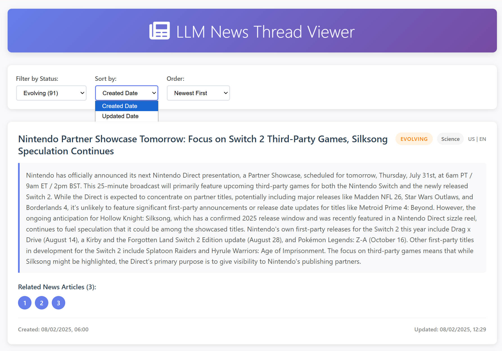
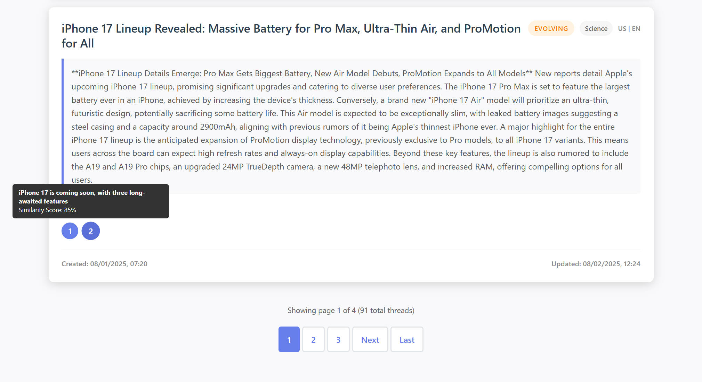

# LLM News Tracker

A Python application that queries the GNews API, uses LLM models to identify entities and analyze news threads, and provides a web interface for viewing the results.





## Features

- **News Collection**: Fetches news from GNews API across multiple categories
- **LLM Analysis**: Uses Azure OpenAI or Google Gemini to analyze news content and identify related threads
- **Thread Management**: Groups related news articles into threads with similarity scoring
- **Web Interface**: Flask-based web UI for viewing and filtering threads
- **Database Storage**: PostgreSQL backend with vector embeddings for similarity matching

## Setup

### Prerequisites
- Python 3.8+
- PostgreSQL with pgvector extension
- Azure OpenAI or Google Gemini API access

### Installation

1. Install dependencies:
```bash
pip install -r requirements.txt
```

2. Set up environment variables by copying `.env-example` to `.env` and filling in your values:
```bash
cp .env-example .env
```

3. Initialize the database:
```bash
python src/sql/setup_db.py
```

## Usage

### Running the News Collection and Analysis
```bash
python src/main.py
```

### Starting the Web Interface
```bash
# Using the startup script
python src/webui/run.py

# Or using the batch/PowerShell scripts
src/webui/start_webui.bat          # Windows batch
src/webui/start_webui.ps1          # PowerShell
```

The web interface will be available at: http://localhost:5000

### Web UI Features
- View paginated list of threads (25 per page)
- Filter threads by status (started, evolving, stale, likely resolved)
- Sort by creation date or update date
- View thread summaries and related news articles
- Responsive design for desktop and mobile

## Project Structure
```
src/
├── main.py              # Main application entry point
├── llm_clients.py       # LLM client implementations
├── prompts.py           # LLM prompt templates
├── sql/                 # Database setup and management
│   ├── schema.sql       # Database schema
│   ├── setup_db.py      # Database initialization
│   └── patch_db.py      # Database patches
├── webui/               # Web interface
│   ├── app.py           # Flask application
│   ├── run.py           # Web UI startup script
│   ├── templates/       # HTML templates
│   └── static/          # CSS and JavaScript
└── tests/               # Unit tests
```

## Testing

Run the unit tests:
```bash
python -m unittest discover src/tests/
```
